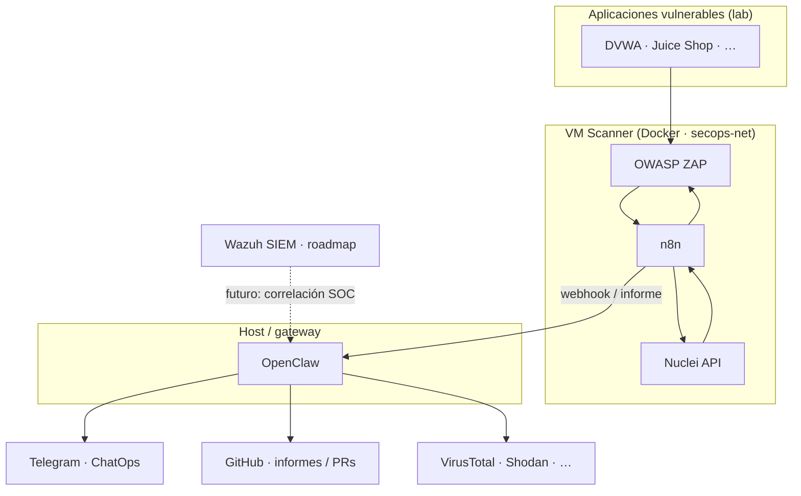

# DespedidaMonteruelo — Análisis de vulnerabilidades automatizado

**Proyecto de innovación educativa** · Ciberseguridad con software libre  
**CIFP Virgen de Gracia** · Equipo: Iván, Luis y Sergio  
*Reto 4 · Hacking ético y puesta en producción segura*

---

## Qué hay en este repositorio

Este proyecto tiene dos partes que conviven en el mismo repo:

1. **Presentación web (GitHub Pages)** — Carpeta [`docs/`](docs/): diapositivas navegables con la arquitectura, el laboratorio SecOps, los flujos **n8n**, la configuración de **[OpenClaw](https://openclaw.ai/)** y el roadmap del SIEM (**Wazuh**). Es HTML, CSS y JavaScript modular, sin framework pesado.
2. **Artefactos del laboratorio** — Plantillas descargables: `docker-compose` para **vm-scanner** y **vm-web**, exportes JSON de workflows n8n, y scripts auxiliares (por ejemplo el wrapper de Nuclei). Sirven para reproducir el entorno **PIRINEUS** descrito en las slides.

La narrativa técnica del laboratorio: **n8n** orquesta escaneos con **OWASP ZAP** y **Nuclei**; el resultado se envía a **OpenClaw** (agente local con gateway, herramientas acotadas por *allowlist* y contexto del *workspace*). Desde ahí se enriquece con fuentes como **VirusTotal** o **Shodan**, se notifica por **Telegram** y se pueden generar **informes en el repositorio** (por ejemplo vía pull requests). **Wazuh** aparece en la presentación como línea evolutiva del SOC (correlación y alertas desde el SIEM), pendiente de despliegue según las slides.

> **Nota sobre el nombre del agente:** en documentación y comunidad el proyecto se alinea con **OpenClaw** (antes conocido como Clawdbot / Moltbot). Donde veas referencias históricas a “Clawbot” en issues o slides antiguas, el rol es el mismo: cerebro del sistema frente a n8n como mero orquestador de escaneos.

---

## Arquitectura (visión simplificada)



---

## Ver la presentación

### En local

Desde la raíz del repositorio (o desde `docs/`):

```bash
npx serve docs
```

Abre la URL que indique la herramienta (suele ser `http://localhost:3000`). Navegación: teclas **←** **→**, menú lateral o botones inferiores.

### En GitHub Pages

Tras configurar Pages en el repositorio, el sitio publica el contenido de **`docs/`**. En GitHub: **Settings → Pages → Build and deployment** (origen: GitHub Actions o rama `main` con carpeta `/docs` según tu configuración).

El workflow [`.github/workflows/deploy.yml`](.github/workflows/deploy.yml) despliega automáticamente cuando hay cambios bajo `docs/**` en la rama `main`.

---

## Cómo está organizado el código

| Ruta | Propósito |
|------|-----------|
| [`docs/index.html`](docs/index.html) | Shell de la app: barra superior, sidebar, contenedor de slides. |
| [`docs/assets/js/app.js`](docs/assets/js/app.js) | Navegación entre slides, progreso, *sidebar*, utilidades (p. ej. copiar al portapapeles). |
| [`docs/assets/js/slides.js`](docs/assets/js/slides.js) | **Orden único de las diapositivas**: importa cada módulo en `slides/` y exporta el array `slides`. |
| [`docs/slides/`](docs/slides/) | Un archivo `.js` por slide: export default con `sectionLabel`, `icon`, `title`, `sub`, `dots`, `content` (HTML). |
| [`docs/assets/css/`](docs/assets/css/) | Estilos globales y por sección (`intro-overview`, `infra-targets`, `secops-lab`, `openclaw-setup`, …). |
| [`docs/assets/downloads/`](docs/assets/downloads/) | Ficheros para descargar: n8n JSON, `docker-compose`, `.env.example` del scanner. |

**Añadir una diapositiva nueva:** crea `docs/slides/<carpeta>/nombre.js`, importa el módulo en `docs/assets/js/slides.js` y añádelo al array `slides` en el orden deseado. Si hace falta estilo dedicado, enlaza una hoja en `docs/index.html`.

Orden actual del *deck*:

1. Introducción — visión general  
2. Infraestructura — objetivos / red  
3. Infraestructura — OPNsense  
4. SecOps — lab (VM Scanner)  
5. SecOps — workflows n8n (Juice Shop / DVWA)  
6. OpenClaw — setup  
7. OpenClaw — workspace  
8. OpenClaw — alertas  
9. SIEM / SOC — Wazuh (estado en slides)

---

## Laboratorio y descargas

| Recurso | Ubicación |
|---------|-----------|
| Stack scanner (n8n, ZAP, Nuclei, …) | [`docs/assets/downloads/vm-scanner/`](docs/assets/downloads/vm-scanner/) · incluye [`docker-compose.yml`](docs/assets/downloads/vm-scanner/docker-compose.yml) y [`.env.example`](docs/assets/downloads/vm-scanner/.env.example) |
| Stack aplicaciones web de práctica | [`docs/assets/downloads/vm-web/docker-compose.yml`](docs/assets/downloads/vm-web/docker-compose.yml) |
| Workflow n8n · Juice Shop | [`docs/assets/downloads/n8n/pirineus-juiceshop-full-scan.json`](docs/assets/downloads/n8n/pirineus-juiceshop-full-scan.json) |
| Workflow n8n · DVWA | [`docs/assets/downloads/n8n/pirineus-dvwa-full-scan.json`](docs/assets/downloads/n8n/pirineus-dvwa-full-scan.json) |

Los JSON de n8n suelen traer placeholders del tipo `REPLACE_WITH_*`; tras importarlos, sustituye credenciales y URLs por variables de entorno o secretos de tu instancia.

Instalación del agente (referencia rápida, alineada con [openclaw.ai](https://openclaw.ai/)):

```bash
curl -fsSL https://openclaw.ai/install.sh | bash
# o: npm i -g openclaw
openclaw onboard
```

El gateway persistente, `systemd --user` y la *allowlist* de acciones están detallados en la slide de setup dentro de `docs/`.

---

## Variables de entorno y secretos

**No subas claves al repositorio.** Usa `.env` en tus máquinas y en los hosts Docker, y **GitHub Secrets** para CI si más adelante automatizas despliegues que las necesiten.

Para el stack del scanner, parte de [`docs/assets/downloads/vm-scanner/.env.example`](docs/assets/downloads/vm-scanner/.env.example) y copia a `.env` en ese mismo contexto de despliegue.

Ejemplo de integraciones habituales (nombres orientativos; revisa cada compose y workflow):

```env
# VirusTotal
VIRUSTOTAL_API_KEY=tu_clave

# Telegram
TELEGRAM_BOT_TOKEN=tu_token
TELEGRAM_CHAT_ID=tu_chat_id

# OWASP ZAP API
ZAP_API_KEY=tu_clave_zap
```

- [Documentación OWASP ZAP API](https://www.zaproxy.org/docs/api/)  
- [VirusTotal API](https://docs.virustotal.com/reference/overview)  
- [Wazuh](https://documentation.wazuh.com/) (cuando integres el SIEM)

---

## Flujo de trabajo con Git

El equipo usa **Git Flow**. Resumen operativo:

| Rama | Uso |
|------|-----|
| `main` | Código estable. **Sin commits directos.** |
| `develop` | Integración del equipo. **Sin trabajar directamente sin feature.** |

**Primera vez en cada máquina:**

```bash
git clone git@github.com:IveenNet/DespedidaMonteruelo.git
cd DespedidaMonteruelo
git flow init
```

(Acepta valores por defecto: producción `main`, desarrollo `develop`.)

**Ciclo diario:**

```bash
git checkout develop && git pull origin develop
git flow feature start nombre-descriptivo
# … commits …
git push origin feature/nombre-descriptivo
git flow feature finish nombre-descriptivo
git push origin develop
```

**Commits:** prefijos útiles `feat:`, `fix:`, `docs:`, `chore:`.

**Reglas:** no *push* directo a `main` ni a `develop`; siempre *feature* desde `develop`; *pull* de `develop` antes de abrir una feature nueva.

Más contexto: [Git Flow (nvie)](https://nvie.com/posts/a-successful-git-branching-model/).

---

## Roadmap coherente con las slides

- Consolidar **OpenClaw** en el host de confianza (gateway, *approvals*, integración con n8n y Telegram).
- Mantener exportes **n8n** y la doc del lab al día en `docs/assets/downloads/`.
- Desplegar **Wazuh** y reglas que enlacen hallazgos del laboratorio con el flujo SOC (ver slide SIEM).

---

## Recursos

- [OpenClaw](https://openclaw.ai/) — instalación, onboarding y documentación del agente  
- [n8n](https://n8n.io/) — orquestación de flujos  
- [OWASP ZAP](https://www.zaproxy.org/) · [ProjectDiscovery Nuclei](https://github.com/projectdiscovery/nuclei)  
- [GitHub Pages](https://pages.github.com/) — alojamiento del sitio estático en `docs/`

---

*Proyecto académico de referencia: automatización SOAR / ChatOps con componentes abiertos y un agente local como capa de razonamiento y acción.*
